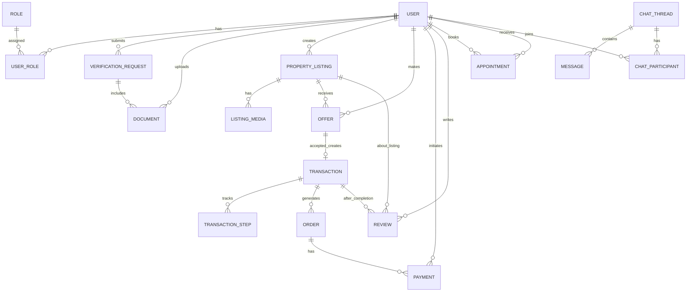
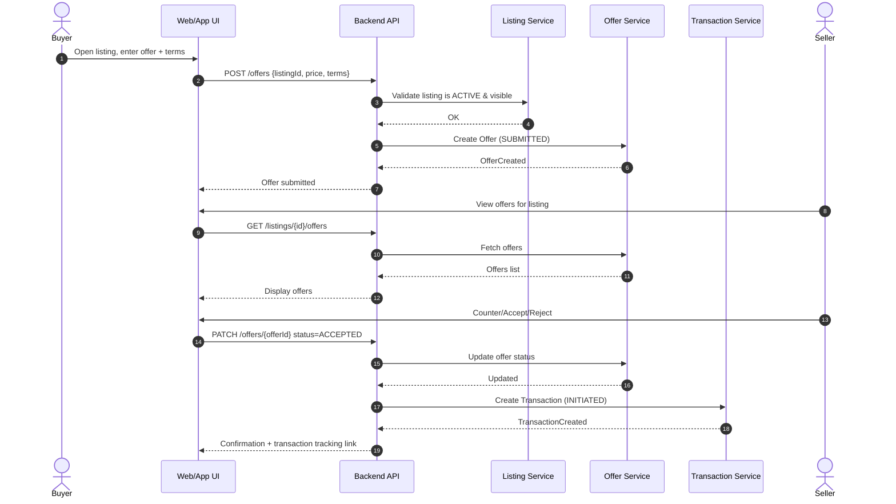
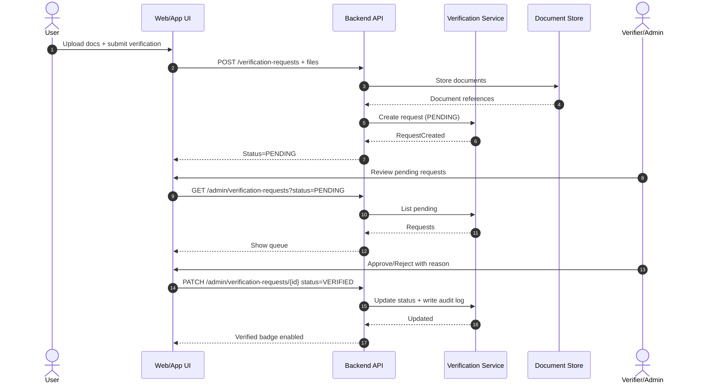
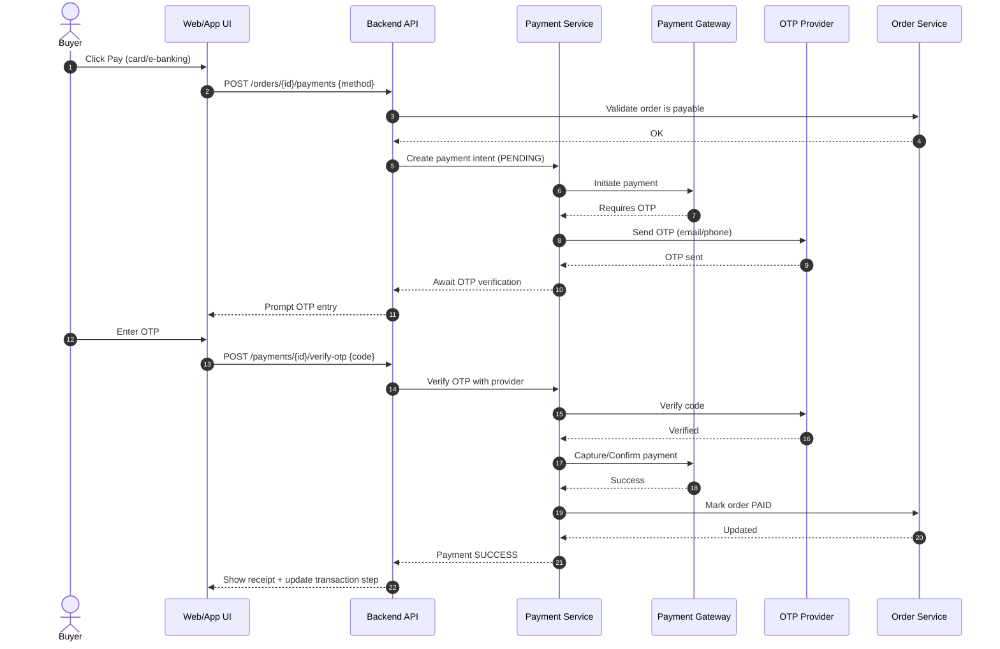
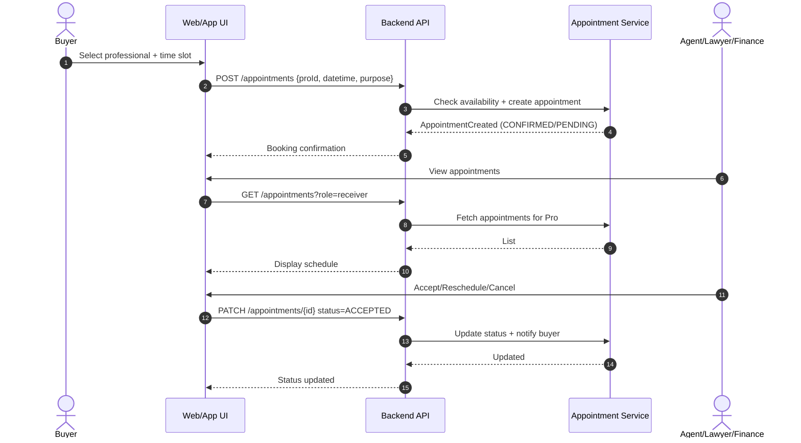

# SRS — MSC Home Rental & Real Estate (MVP-Ready)
**Document ID:** SRS_MSC_HOME  
**Version:** 1.1  
**Basis:** “Road map of MSC Home” UX Case Study (PDF).  
**Audience:** Product, Engineering, QA, Delivery

> This SRS is derived from a UX case study and user-flow / IA infographics. Items marked **[Inferred]** translate UX intent into implementable requirements.

---

## Table of Contents
1. Introduction  
2. Product Overview  
3. Stakeholders & User Actors  
4. Personas  
5. System Modules & Scope  
6. Assumptions, Constraints, Dependencies  
7. Functional Requirements (FR)  
8. Business Rules (BR)  
9. User Stories (US)  
10. Data Requirements  
11. ERD  
12. Transaction Step Tracking  
13. Sequence Diagrams  
14. Non-Functional Requirements (NFR)  
15. MVP Scope & Prioritized Backlog (Epics → Stories → Tasks)  
16. Appendices (Traceability)

---

## 1. Introduction

### 1.1 Purpose
Define complete software requirements for **MSC Home Rental & Real Estate**, a verified property marketplace with integrated **communication**, **legal & financial support**, **secure payments**, and **reputation-based trust**.

### 1.2 Scope
MSC Home supports:
- Account creation + professional mode switching
- Identity + professional verification (badges)
- Verified property listings + listing “Accuracy Score”
- Advanced search + map-based search + favorites
- In-platform chat/audio/video + appointment booking
- Offers/negotiation → order → payment → tracked transaction
- Legal support and financial/loan support
- Post-transaction ratings/reviews
- Community features (groups/pages/posts) + blogs/videos

### 1.3 Definitions
- **Accuracy Score:** Completeness score shown on listings (**from UX improvement list**).
- **Verified Badge:** Profile indicator after successful verification.
- **RBAC:** Role-based access control. **[Inferred]**
- **KYC/eKYC:** Identity verification. **[Inferred]**

---

## 2. Product Overview

### 2.1 Problem Summary
Bangladesh real estate market suffers from:
- Low trust, hidden property details, unfair pricing
- Difficulty verifying legal papers / seriousness of parties
- Loan affordability constraints
- Incomplete online information, poor advertising

### 2.2 Product Vision
MSC Home provides a secure, verified, transparent environment for buyers/sellers/agents/companies and integrates legal + financial partners for safer, faster transactions.

### 2.3 Key Research Signals → Requirements
- Trustworthiness + verification is top priority
- Advanced search is “must-have”
- Secure payments are highly valued
- Affordable loan support is highly demanded
- Ratings/reviews expected after transactions

---

## 3. Stakeholders & User Actors

### 3.1 Primary Actors
1. **Buyer** (general / first-time)
2. **Renter**
3. **Seller / Owner** (flat owner, land owner)
4. **Realtor / Broker / URA-certified Agent**
5. **Legal Agent (Lawyer)**
6. **Financial Agent / Financial Institute**
7. **Service Provider** (architect, interior/exterior designer, electrician, etc.)
8. **Social User** (community-only)

### 3.2 Secondary Actors **[Inferred]**
9. **Admin**
10. **Verifier / Moderator**
11. **Customer Support**

---

## 4. Personas

### 4.1 Seller Persona (Rakib Hasan)
- Experienced seller/renter, wants trust, faster transactions, legal & loan assistance, verification.

### 4.2 Buyer Persona (Sumaiya Akter)
- First-time buyer, concerned about high prices, fraud, legal complexity, loan access; values secure payments and virtual tours.

---

## 5. System Modules & Scope

1. Auth & Account  
2. User Profile + Professional Mode  
3. Verification & Badges  
4. Marketplace (Buy/Sell/Rent)  
5. Listings & Media (photos/videos/virtual tours)  
6. Search (advanced filters + map)  
7. Offers/Negotiation + Transaction Tracking  
8. Payments (card/e-banking + OTP)  
9. Legal Support Services  
10. Financial Support Services (loan help)  
11. Communication (chat/audio/video) + Appointments  
12. Reputation (ratings/reviews)  
13. Community (groups/pages/posts)  
14. Blogs & Videos  
15. Admin/Moderation **[Inferred]**

---

## 6. Assumptions, Constraints, Dependencies

### 6.1 Assumptions
- Users consent to document upload and verification.
- Platform partners exist (legal/financial).
- Payment gateways provide OTP verification.

### 6.2 Constraints
- Personal info security is mandatory.
- Verified badge and verified listings must be supported.
- Offer/negotiation must exist.

### 6.3 Dependencies **[Inferred]**
- Maps provider (Google Maps or equivalent)
- OTP provider (SMS/Email)
- Payment gateway(s)
- Media storage/CDN
- Optional KYC verification provider

---

## 7. Functional Requirements (FR)

> Priority: **P0 (MVP must)**, **P1 (near-term)**, **P2 (later)**

### 7.1 Authentication & Account
- **FR-1 (P0): Register** via email/phone/password + social login.
- **FR-2 (P0): Login/Logout** + forgot password.
- **FR-3 (P0): Professional Mode Switch** (social user ↔ professional role flow).

### 7.2 User Profile & Professional Data
- **FR-4 (P0): Profile Management** (name, contact, photo).
- **FR-5 (P0): Professional Profile** captures bank details, BIN/TIN, NID/licenses, financial statement; role-specific docs (BAR certificate, institute credential report).

### 7.3 Verification & Trust
- **FR-6 (P0): Submit Verification** request with documents.
- **FR-7 (P0): Review Workflow** approve/reject + reason (admin/verifier).
- **FR-8 (P0): Verified Badge** visible on profile/listings.
- **FR-9 (P1): Listing Accuracy Score** computed from completeness.

### 7.4 Listings & Media
- **FR-10 (P0): Create Listing** with location/area/price/terms/media/docs.
- **FR-11 (P0): Listing Verification** (ownership + info verification steps).
- **FR-12 (P1): Virtual Tours** (as media or external link).
- **FR-13 (P0): Favorites** (save listings).

### 7.5 Search & Discovery
- **FR-14 (P0): Advanced Search** filters: location/price/area + verified-only.
- **FR-15 (P1): Map-Based Search**.

### 7.6 Communication & Appointments
- **FR-17 (P0): Live Chat** between buyer ↔ seller/agent.
- **FR-18 (P1): Audio/Video Call** (integrated SDK).
- **FR-19 (P0): Appointment Booking** for agents/legal/financial.
- **FR-20 (P0): Purpose Capture** for contact (message purpose).

### 7.7 Offers, Orders, Transactions
- **FR-21 (P0): Submit Offer** securely.
- **FR-22 (P0): Negotiate** (counter/accept/reject).
- **FR-23 (P0): Transaction Step Tracking** visible to both parties.
- **FR-24 (P0): Place Order** for property/service.
- **FR-25 (P0): Confirm/Cancel Order** with state transitions.

### 7.8 Payments
- **FR-26 (P0): Payment Methods** card + e-banking + OTP.
- **FR-27 (P0): Secure Payment Records** linked to order/transaction.
- **FR-28 (P1): Buyer Protection / Dispute hooks** (minimal dispute workflow). **[Inferred]**

### 7.9 Legal Support
- **FR-29 (P0): Legal Service Discovery**.
- **FR-30 (P0): Book Legal Agent**.
- **FR-31 (P1): Legal Guides** content module.

### 7.10 Financial Support
- **FR-32 (P0): Financial Service Discovery**.
- **FR-33 (P1): Loan Assistance Workflow** request → response → status tracking. **[Inferred]**

### 7.11 Service Provider Marketplace
- **FR-34 (P1): Service Listings** create + set prices.
- **FR-35 (P1): Book Now / Order Services**.
- **FR-36 (P1): Provider Payout Hooks**. **[Inferred]**
- **FR-37 (P1): Service Reviews**.

### 7.12 Reviews & Reputation
- **FR-38 (P0): Mutual Rating** buyer ↔ seller after completion.
- **FR-39 (P0): Listing/Agent Reviews**.
- **FR-40 (P1): Feedback Tools** respond to reviews + issue resolution.

### 7.13 Community + Content
- **FR-41 (P2): Search** groups/pages/posts/people/places.
- **FR-42 (P2): Groups** join + “Your Groups”.
- **FR-43 (P2): Pages** follow/like.
- **FR-44 (P2): Posts** create + like/comment/share.
- **FR-45 (P2): View Blogs & Videos**.
- **FR-46 (P2): Post Blogs & Videos** (moderated).

### 7.14 Admin **[Inferred]**
- **FR-47 (P0): Admin Console** manage users, verifications, listings, transactions.
- **FR-48 (P0): Audit Logs** for verification & payment events.

---

## 8. Business Rules (BR)

### 8.1 Verification
- **BR-1:** Verified badge only after successful verification approval.
- **BR-2:** Role-based document requirements (lawyer BAR certificate, institute credential report, etc.).
- **BR-3:** Listing “Verified” requires ownership verification completion.

### 8.2 Accuracy Score
- **BR-4:** Accuracy Score is computed from field completeness (required + optional weights).
- **BR-5 (optional):** Higher score boosts ranking. **[Inferred]**

### 8.3 Offers/Transactions
- **BR-6:** Only logged-in buyers can submit offers.
- **BR-7:** Offer states: Submitted → Countered → Accepted/Rejected/Withdrawn.
- **BR-8:** Accepted offer creates a transaction record with trackable steps.
- **BR-9:** Steps are append-only and timestamped (auditability). **[Inferred]**

### 8.4 Payments
- **BR-10:** Payment must reference one order; order must reference one transaction (if property).
- **BR-11:** OTP is required for payment confirmation.
- **BR-12:** Cancel rules: if payment succeeded, refund flow is initiated. **[Inferred]**

### 8.5 Reviews
- **BR-13:** Reviews allowed only after transaction completion.
- **BR-14:** One review per party per transaction (default). **[Inferred]**

---

## 9. User Stories (MVP Set)

### 9.1 Buyer
- **US-B1:** Search properties with filters and see verified listings.
- **US-B2:** View listing details (photos/videos/docs status) and save favorites.
- **US-B3:** Contact agent/seller via chat and book an appointment.
- **US-B4:** Submit offer and negotiate.
- **US-B5:** Track transaction steps until completion.
- **US-B6:** Pay securely with OTP and receive confirmation.
- **US-B7:** Leave ratings/review after completion.

### 9.2 Seller / Agent
- **US-S1:** Create listing with complete details/media and submit for verification.
- **US-S2:** Submit verification documents and receive verified badge.
- **US-S3:** Respond to inquiries/offers quickly and manage appointments.
- **US-S4:** Accept/counter offers and complete transaction.
- **US-S5:** Receive reviews and respond to feedback.

### 9.3 Legal / Financial
- **US-L1:** Verified legal agent can receive bookings and provide support notes.
- **US-F1:** Verified financial agent can receive loan support requests.

---

## 10. Data Requirements

### 10.1 Core Entities
- User, Role, UserRole  
- VerificationRequest, Document  
- PropertyListing, ListingMedia  
- Offer  
- Transaction, TransactionStep  
- Order, Payment  
- Review  
- Appointment  
- ChatThread, Message  
- (Optional later) Group, Page, Post, Blog, Video

---

## 11. ERD (Mermaid)

---

## 12. Transaction Step Tracking (Recommended MVP State Machine)

### 12.1 Transaction Status
- INITIATED
- DOCS_PENDING
- LEGAL_REVIEW
- FINANCE_PROCESSING (optional)
- PAYMENT_PENDING
- IN_PROGRESS
- COMPLETED
- CANCELLED

### 12.2 Steps (append-only)
1. Offer Accepted  
2. Document Collection Started  
3. Ownership Verification Completed  
4. Legal Review Completed  
5. Loan Approved/Rejected (optional)  
6. Payment Initiated  
7. Payment Confirmed (OTP)  
8. Agreement Signed  
9. Handover Completed  
10. Transaction Closed + Reviews Enabled  

---

## 13. Sequence Diagrams (Mermaid)

### 13.1 Offer Flow (Buyer ↔ Seller)

### 13.2 Verification Flow (User → Verifier)

### 13.3 Payment Flow (Order + OTP)

### 13.4 Appointment Flow (Buyer books Agent/Lawyer/Finance)

---

## 14. Non-Functional Requirements (NFR)

### 14.1 Security
- TLS everywhere; encryption at rest for sensitive documents.
- RBAC on all endpoints.
- Audit logs for verification and payments.

### 14.2 Performance
- Search response target < 2s for typical filters. **[Inferred]**
- Media via CDN. **[Inferred]**

### 14.3 Reliability
- Resilient payment flow (idempotency keys; retry-safe). **[Inferred]**

### 14.4 Privacy
- Strict access to documents (only owner + verifier + permitted parties). **[Inferred]**

---

## 15. MVP Scope & Prioritized Backlog (Aligned with User Flow Diagram)

### 15.1 MVP Goals (P0)
- Verified identities + verified listings
- Search → view → contact → offer → transaction tracking → payment → reviews
- Appointment booking
- Basic legal/financial discovery (directory + booking/request)

### 15.2 Epic Breakdown (Epics → Stories → Tasks)

#### EPIC 1 — Authentication & Onboarding (P0)
- **Story 1.1:** As a user, I can sign up/login (email/phone/password + social).
  - Tasks:
    - Implement auth endpoints (register/login/logout/forgot)
    - Social login integration
    - Session/JWT + refresh strategy
    - Basic profile setup screen
- **Story 1.2:** As a user, I can switch to Professional Mode and choose role.
  - Tasks:
    - Role selection UI + API
    - RBAC middleware and route guards

#### EPIC 2 — Profile + Verification (P0)
- **Story 2.1:** As a professional, I can submit verification docs.
  - Tasks:
    - Document upload service (storage + metadata)
    - Verification request creation (PENDING)
    - Role-based required docs validation
- **Story 2.2:** As an admin, I can approve/reject verification.
  - Tasks:
    - Admin queue UI + API
    - Approve/reject with reason
    - Badge display toggle
    - Audit log entries

#### EPIC 3 — Listings (Create/Manage/Verify) (P0)
- **Story 3.1:** As a seller, I can create a listing with media and terms.
  - Tasks:
    - Listing CRUD (draft/submit/publish)
    - Media upload & gallery
    - Listing status state machine
- **Story 3.2:** As platform, I can mark listings verified after checks.
  - Tasks:
    - Listing verification checklist fields
    - Verified badge for listings
    - (P1) Accuracy Score computation

#### EPIC 4 — Search & Discovery (P0)
- **Story 4.1:** As a buyer, I can search with filters (location/price/area).
  - Tasks:
    - Search API endpoints
    - Filter UI components
    - Verified-only toggle
- **Story 4.2:** As a buyer, I can favorite listings.
  - Tasks:
    - Favorites table + endpoints
    - UI save/remove favorites
- **Story 4.3 (P1):** Map-based search.
  - Tasks:
    - Maps integration
    - Geo search / bounding box queries

#### EPIC 5 — Communication (Chat) + Appointments (P0)
- **Story 5.1:** As a buyer/seller, I can chat in-platform.
  - Tasks:
    - Chat threads + messages schema
    - Realtime layer (WebSockets) **or** polling MVP
    - Read receipts (optional)
- **Story 5.2:** As a buyer, I can book appointments with agents/legal/finance.
  - Tasks:
    - Appointment CRUD + statuses
    - Availability model (simple slots)
    - Notifications (email/SMS) **[Inferred]**

#### EPIC 6 — Offers, Negotiation, Transaction Tracking (P0)
- **Story 6.1:** As a buyer, I can submit offers securely.
  - Tasks:
    - Offer create/read endpoints
    - Offer list for seller
    - Offer status transitions
- **Story 6.2:** As parties, we can track transaction steps.
  - Tasks:
    - Transaction creation on accept
    - TransactionStep append-only model
    - UI timeline component
    - Permissions: only involved users can view

#### EPIC 7 — Payments (OTP) + Orders (P0)
- **Story 7.1:** As a buyer, I can pay via card/e-banking with OTP.
  - Tasks:
    - Payment intent + gateway integration
    - OTP send + verify
    - Update order/payment state
    - Receipt/confirmation screen
    - Idempotency + retry protection **[Inferred]**
- **Story 7.2:** As a user, I can cancel/confirm orders.
  - Tasks:
    - Cancel/confirm endpoints
    - Refund hooks (minimal; gateway dependent) **[Inferred]**

#### EPIC 8 — Reviews & Reputation (P0)
- **Story 8.1:** As buyer/seller, we can review each other after completion.
  - Tasks:
    - Review model + gating by transaction completion
    - Profile rating aggregates
    - Listing reviews display
    - Feedback response tools (P1)

#### EPIC 9 — Legal & Financial Support Directory (P0)
- **Story 9.1:** As a user, I can find legal agents and book them.
  - Tasks:
    - Legal agent role listing directory
    - Appointment tie-in
- **Story 9.2:** As a user, I can find financial agents and request loan support.
  - Tasks:
    - Financial agent directory
    - Loan request ticket model (P1)

#### EPIC 10 — Community + Blogs/Videos (P2)
- Defer to post-MVP unless explicitly required.

---

## 16. Appendices — Traceability
- Personas & empathy mapping: inform profile, trust, legal/loan needs
- Seller/Buyer journey: informs listing completeness, verification, transaction tracking, feedback loop
- Brainstorming & IA: informs modules and navigation
- User flow diagram: informs role switching, service provider marketplace, order/payment/reviews loop

---

## Export Notes
- This document is **Markdown + Mermaid**.
- Mermaid diagrams render in GitHub, GitLab, many wiki tools, and Mermaid live editors.
