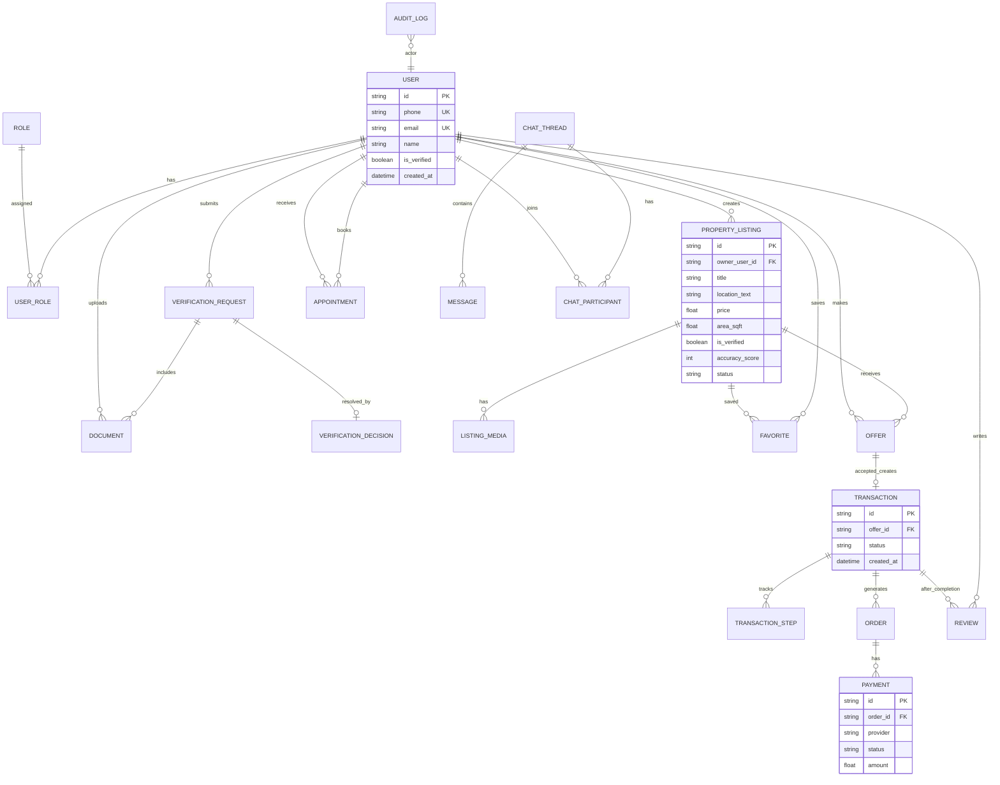

# SRS — MSC Home Rental & Real Estate (Enhanced)
**Document ID:** SRS_MSC_HOME_V2  
**Version:** 2.2 (Comprehensive Enhanced + Traceability)  
**Basis:** Original SRS v1.1 + UX Case Study Slides (OCR) + BD market research  
**Audience:** Product, Engineering, QA, Delivery, Partners

> This document consolidates the original MVP SRS and expands it with Bangladesh-specific workflows (Bayna/Dalil/Namjari), partner integrations (e-KYC and payment gateway), and the missing business logic identified from the slides.

---

## Table of Contents
1. Introduction  
2. Product Overview  
3. Stakeholders & User Actors  
4. Personas  
5. System Modules & Scope  
6. Assumptions, Constraints, Dependencies  
7. Functional Requirements (FR)  
8. Business Rules (BR)  
9. User Stories (US)  
10. Data Requirements  
11. ERD  
12. Transaction Step Tracking  
13. Sequence Diagrams  
14. Non-Functional Requirements (NFR)  
15. MVP Scope & Prioritized Backlog  
16. Appendices (Traceability & Glossary)

---

## 1. Introduction

### 1.1 Purpose
Define comprehensive, implementable requirements for **MSC Home Rental & Real Estate**, a verified property marketplace for Bangladesh that includes **communication**, **legal & financial support**, **secure payments**, and **reputation-based trust**.

### 1.2 Scope
MSC Home supports (MVP-first):
- Account creation + professional mode switching
- Identity + professional verification (badges)
- Verified property listings + listing **Accuracy Score**
- Advanced search + map-based search + favorites
- In-platform chat + audio/video + appointment booking
- Offers/negotiation → order → payment → transaction tracking
- Legal support directory + booking/case tracking (MVP: manual workflow supported)
- Financial/loan support directory + requests (MVP: lead workflow supported)
- Post-transaction ratings/reviews

Deferred / optional (P2):
- Community features (groups/pages/posts)
- Blogs/videos publishing (moderated)

### 1.3 Definitions (BD-context)
- **Accuracy Score:** Completeness score shown on listings; computed from required/optional field completeness.
- **Verified Badge:** Profile indicator after successful verification approval.
- **Verified Listing:** A listing marked verified after ownership + information verification checks.
- **Bayna / Baina Nama:** Sale agreement / agreement to sell, commonly used in Bangladesh property transactions.
- **Dalil:** Registered deed at the Sub-Registrar office.
- **Namjari (Mutation):** Mutation process updating ownership records.
- **RBAC:** Role-based access control.
- **KYC/eKYC:** Identity verification.

---

## 2. Product Overview

### 2.1 Problem Summary
Bangladesh’s real estate market suffers from:
- Low trust, hidden property details, unfair pricing
- Difficulty verifying legal papers / seriousness of parties
- Loan affordability constraints
- Incomplete online information and poor advertising

### 2.2 Product Vision
MSC Home provides a secure, verified, transparent environment for buyers/sellers/agents/companies and integrates legal + financial partners for safer, faster transactions.

### 2.3 Research Signals (Cross-validated from Slides OCR)
From the case study survey/journey artifacts:
- **Advanced Search** demand: **97.6%**
- Importance of **trustworthiness**: **78.3%**
- Interest in **affordable loans**: **90.4%**
- Interest in **secure payments**: **69.9%**
- Desire to **rate buyers/sellers** after transaction: **95.2%**

Feature-preference breakdown:
- Secure payments: **69.9%**
- Affordable loans: **37.3%**
- Legal support: **27.7%**
- Virtual tours: **24.1%**

Implication: the MVP must strongly prioritize **search**, **verification/trust**, **payments**, and **post-transaction reviews**.

---

## 3. Stakeholders & User Actors

### 3.1 Primary Actors
1. Buyer
2. Renter
3. Seller / Owner (flat owner, land owner)
4. Realtor / Broker / Agent (including URA-certified agent where applicable)
5. Legal Agent (Lawyer / Law firm)
6. Financial Agent / Financial Institute
7. Service Provider (architect, interior/exterior designer, electrician, etc.)
8. Social User (community-only)

### 3.2 Secondary Actors
9. Admin
10. Verifier / Moderator
11. Customer Support
12. Field Verifier (in-person property verification)

---

## 4. Personas

### 4.1 Seller Persona (Rakib Hasan)
- Experienced seller/renter; wants faster transactions, legal & loan assistance, verification.

### 4.2 Buyer Persona (Sumaiya Akter)
- First-time buyer; concerned about fraud, complex legal steps, high prices, loan access.

### 4.3 Agent Persona (Inferred)
- Wants lead generation, fast chat response, appointment scheduling, high credibility badges.

---

## 5. System Modules & Scope

1. Auth & Account (email/phone + OTP + social)
2. User Profile + Professional Mode
3. Verification & Badges (including e-KYC integration option)
4. Marketplace (Buy/Sell/Rent)
5. Listings & Media (photos/videos/virtual tours) + Document Vault
6. Search (advanced filters + map) + saved searches
7. Offers/Negotiation + Transaction Tracking (Bayna/Dalil/Namjari-aware)
8. Payments (gateway + OTP/3DS) + payment records
9. Legal Support Services (directory + booking + case tracking)
10. Financial Support Services (directory + loan request workflow)
11. Communication (chat/audio/video) + Appointments
12. Reputation (ratings/reviews)
13. Notifications (in-app + email/SMS) **[Inferred but required]**
14. Admin/Moderation (users, verifications, listings, transactions, disputes)
15. Community + Blogs/Videos (P2)
16. Monetization & Billing (subscriptions, featured listings) **[Inferred]**
17. Government Land Portals (link-outs + tracking) **[BD-context]**

---

## 6. Assumptions, Constraints, Dependencies

### 6.1 Assumptions
- Users consent to document upload and verification.
- Legal/financial partners exist.
- Payment gateway provides OTP/3DS or equivalent confirmation.
- For MVP, some legal/verification steps may be **manual but trackable**.

### 6.2 Constraints
- Personal info security is mandatory.
- Verified badge and verified listings must be supported.
- Offer/negotiation must exist.

### 6.3 Dependencies
- Maps provider (Google Maps or equivalent)
- OTP provider (SMS/Email)
- Payment gateway(s) (e.g., SSLCOMMERZ aggregator)
- Media storage/CDN
- Optional e-KYC provider (e.g., Porichoy for NID verification)
- Optional video SDK (Agora/Twilio/Jitsi)

---

## 7. Functional Requirements (FR)

> Priority: **P0 (MVP must)**, **P1 (near-term)**, **P2 (later)**

### 7.1 Authentication & Account
- **FR-1 (P0): Register** via email/phone/password + social login.
- **FR-2 (P0): Login/Logout** + forgot password.
- **FR-3 (P0): Professional Mode Switch** (social user ↔ professional role flow).
- **FR-4 (P0): OTP Login** via phone (optional in v1.1; required by BD market fit).

### 7.2 User Profile & Professional Data
- **FR-5 (P0): Profile Management** (name, contact, photo).
- **FR-6 (P0): Professional Profile** captures bank details, BIN/TIN, NID/licenses, financial statement; role-specific docs (BAR certificate, institute credential report).
- **FR-7 (P1): Reputation Summary** (rating averages, verified badges, response time metrics).

### 7.3 Verification & Trust
- **FR-8 (P0): Submit Verification** request with documents.
- **FR-9 (P0): Review Workflow** approve/reject + reason (admin/verifier).
- **FR-10 (P0): Verified Badge** visible on profile/listings.
- **FR-11 (P1): e-KYC Provider Check** (e.g., NID verification via an external provider) with fallback to manual verification.

### 7.4 Listings & Media
- **FR-12 (P0): Create Listing** with location/area/price/terms/media/docs.
- **FR-13 (P0): Listing Verification** (ownership + info verification steps).
- **FR-14 (P1): Virtual Tours** (as media or external link).
- **FR-15 (P0): Favorites** (save listings).
- **FR-16 (P0): Document Vault** for sensitive docs (deeds, mutation, tax receipts) with strict access.
- **FR-17 (P1): Unit Converter** (SqFt ↔ Katha/Decimal/Shotok).
- **FR-18 (P1): Market Value Guidance** (manual inputs by agents/admin + optional analytics later) as suggested by the UX journey maps.

### 7.5 Search & Discovery
- **FR-19 (P0): Advanced Search** filters: location/price/area + verified-only.
- **FR-20 (P1): Map-Based Search**.
- **FR-21 (P1): Saved Searches + Alerts** (notify when a matching listing is published).
- **FR-22 (P1): Compare Listings** up to N items side-by-side.

### 7.6 Communication & Appointments
- **FR-23 (P0): Live Chat** between buyer ↔ seller/agent.
- **FR-24 (P1): Audio/Video Call** (integrated SDK).
- **FR-25 (P0): Appointment Booking** for agents/legal/financial.
- **FR-26 (P0): Purpose Capture** for contact (message purpose).

### 7.7 Offers, Orders, Transactions
- **FR-27 (P0): Submit Offer** securely.
- **FR-28 (P0): Negotiate** (counter/accept/reject/withdraw).
- **FR-29 (P0): Transaction Step Tracking** visible to both parties.
- **FR-30 (P0): Place Order** for property/service.
- **FR-31 (P0): Confirm/Cancel Order** with state transitions.
- **FR-32 (P0): Proof Uploads per Step** (e.g., Bayna copy, Dalil copy, Namjari/mutation docs) to keep the digital timeline verifiable.

### 7.8 Payments
- **FR-33 (P0): Payment Methods** card + e-banking + OTP/3DS.
- **FR-34 (P0): Secure Payment Records** linked to order/transaction.
- **FR-35 (P1): Buyer Protection / Dispute Hooks** minimal dispute workflow.

### 7.9 Legal Support
- **FR-36 (P0): Legal Service Discovery**.
- **FR-37 (P0): Book Legal Agent**.
- **FR-38 (P1): Legal Case Tracking** (case created, docs uploaded, report delivered).

### 7.10 Financial Support
- **FR-39 (P0): Financial Service Discovery**.
- **FR-40 (P1): Loan Assistance Workflow** request → response → status tracking.

### 7.11 Reviews & Reputation
- **FR-41 (P0): Mutual Rating** buyer ↔ seller after completion.
- **FR-42 (P0): Listing/Agent Reviews**.
- **FR-43 (P1): Feedback Tools** respond to reviews + issue resolution.

### 7.12 Notifications
- **FR-44 (P0): In-app Notifications** for offers, chat, booking, verification, payment events.
- **FR-45 (P1): SMS/Email Notifications** for critical steps.

### 7.13 Community + Content (P2)
- **FR-46 (P2): Search** groups/pages/posts/people/places.
- **FR-47 (P2): Groups/Pages/Posts** create + join + like/comment/share.
- **FR-48 (P2): View Blogs & Videos**.
- **FR-49 (P2): Post Blogs & Videos** (moderated).

### 7.14 Admin/Moderation
- **FR-50 (P0): Admin Console** manage users, verifications, listings, transactions, disputes.
- **FR-51 (P0): Audit Logs** for verification & payment events.

### 7.15 Transparency, Guides, and FAQs
- **FR-52 (P0): Ownership Verification Guide UI** provides step-by-step guidance for sellers on how to prove ownership and what documents are expected (linked to listing verification workflow).
- **FR-53 (P1): Legal & Loan Guides** provide checklists, explanations of steps (Bayna/Dalil/Namjari), and loan option explanations (CMS-backed).
- **FR-54 (P1): FAQ Templates** allow sellers/agents to attach common Q&A to a listing (e.g., service charge, utility status, facing, parking, handover date).
- **FR-55 (P1): Cost Transparency Fields** capture and display known costs (e.g., service charge, maintenance, booking money/deposit, additional fees) and explicitly label “unknown / not provided” fields.

### 7.16 Safety, Abuse Reporting, and Disputes
- **FR-56 (P0): Report Listing/User** (fraud, spam, inappropriate content) from UI.
- **FR-57 (P1): Dispute Case Management** (open dispute, evidence upload, admin resolution, outcome notifications).

### 7.17 Real Estate Company / Project Listings (from interview insights)
- **FR-58 (P1): Project Listing Type** supports developer/company projects with units, handover date, and construction progress.
- **FR-59 (P1): Project Progress Updates** allow verified developers to post progress updates (admin-moderated) to reduce “slow project completion” trust issues.

### 7.18 Monetization & Billing
- **FR-60 (P1): Subscription Plans** for agents/developers (limits, analytics, featured placements).
- **FR-61 (P1): Featured Listings** (pay-per-duration) with clear labeling.

### 7.19 Service Provider Marketplace (Gap closure from v1.1)
- **FR-62 (P1): Service Listings** service providers can create/edit listings with category, service area, price model, availability, and portfolio.
- **FR-63 (P1): Book/Order Services** users can request or book a service (with schedule, location, scope, and notes).
- **FR-64 (P1): Provider Payout Hooks** store provider payout account details and payout status per service order (implementation may be manual in MVP).
- **FR-65 (P1): Service Reviews** users can review service providers after a completed service order.

### 7.20 Government Land Portals (BD-context: link-out + tracking)
- **FR-66 (P0): Official Portal Deep Links** provide help-center links and contextual buttons to official portals for:
    - Land record/map services (DLRMS)
    - Online mutation (e-Namjari)
    - Land Development Tax (ভূমি উন্নয়ন কর)
- **FR-67 (P0): Portal Reference Capture** allow users to store portal references (e.g., application number, holding/khatian references, mobile number used for tracking) as part of a transaction timeline without requiring the platform to integrate directly with government systems.
- **FR-68 (P1): Status Tracking Assistance** provide a guided “check status” UX that mirrors portal inputs (e.g., application number + mobile + captcha math), and stores a user-entered status snapshot with timestamp.
- **FR-69 (P1): Proof Attachments from Portals** support uploading QR-coded documents (e.g., khatian copy / DCR) as step proofs and link them to transaction steps.

### 7.21 Payment Gateway Integration (SSLCOMMERZ-style hardening)
- **FR-70 (P0): Hosted Checkout Support** support redirect-based hosted checkout in addition to (or instead of) embedded checkout for MVP reliability.
- **FR-71 (P0): IPN/Webhook Listener** implement a server-to-server notification endpoint to receive payment status updates independent of the user’s browser session.
- **FR-72 (P0): Post-Payment Validation Call** validate successful payment notifications by calling the gateway validation endpoint and reconciling amount/currency/transaction IDs before marking orders as PAID.
- **FR-73 (P1): Refund Operations** support initiating and tracking refunds (gateway dependent) and store refund reference IDs/status.
- **FR-74 (P1): Risk Holds** if gateway flags a payment as risky, the system must place the order in a “HOLD” state for manual verification.

---

## 8. Business Rules (BR)

### 8.1 Verification
- **BR-1:** Verified badge only after successful verification approval.
- **BR-2:** Role-based document requirements (lawyer BAR certificate, institute credential report, etc.).
- **BR-3:** Listing “Verified” requires ownership verification completion.
- **BR-4 (P1):** If e-KYC provider check fails/unavailable, verification can proceed manually; the system stores provider attempts for audit.

### 8.2 Accuracy Score
- **BR-5:** Accuracy Score is computed from field completeness (required + optional weights).
- **BR-6:** Accuracy Score formula:
    $$\text{AccuracyScore} = \left(\frac{\sum w_i \cdot \mathbb{1}[field_i\ present]}{\sum w_i}\right) \times 100$$
    Weights are configurable by Admin.
- **BR-7 (optional):** Higher score boosts ranking.

### 8.3 Cost Transparency
- **BR-8:** A listing must not claim “no extra costs” unless the seller explicitly confirms all cost fields.
- **BR-9:** If a seller does not provide a cost field, UI must label it as “Not provided” (to avoid hidden costs).

### 8.3 Offers/Transactions
- **BR-10:** Only logged-in buyers can submit offers.
- **BR-11:** Offer states: SUBMITTED → COUNTERED → ACCEPTED/REJECTED/WITHDRAWN.
- **BR-12:** Accepted offer creates a transaction record.
- **BR-13:** Transaction steps are append-only and timestamped.
- **BR-14:** Step proof rules (MVP): step can be marked complete only if required proof type is attached (document or counterparty confirmation).

### 8.4 Payments
- **BR-15:** Payment must reference one order; order must reference one transaction (if property).
- **BR-16:** OTP/3DS is required for payment confirmation (gateway-dependent).
- **BR-17:** Cancel rules: if payment succeeded, refund flow is initiated.

### 8.5 Buyer Protection / Disputes
- **BR-18 (P1):** A dispute can be opened only for PAID orders within a configurable window.
- **BR-19 (P1):** Dispute status changes are admin-audited.

### 8.6 Reviews
- **BR-20:** Reviews allowed only after transaction completion.
- **BR-21:** One review per party per transaction.

### 8.7 Service Provider Marketplace
- **BR-22:** Service reviews are allowed only after a service order is completed.
- **BR-23:** Provider payout status must be auditable (who approved, when, and reference details).

### 8.8 Payment Gateway Validation & Risk
- **BR-24:** An order must be marked PAID only after back-end validation succeeds (IPN alone is not sufficient).
- **BR-25:** Back-end validation must reconcile at minimum: transaction ID, amount, currency type, and final status.
- **BR-26:** If the gateway returns a “risky” flag for an otherwise successful payment, the platform must place the order into a HOLD state and require additional verification before delivering buyer protection guarantees or releasing service confirmation.
- **BR-27:** The payment integration must require TLS 1.2+ on the merchant server and use server-to-server calls for sensitive API operations.

---

## 9. User Stories (US)

### 9.1 Buyer
- **US-B1:** Search properties with filters and see verified listings.
- **US-B2:** View listing details (photos/videos/docs status) and save favorites.
- **US-B3:** Contact agent/seller via chat and book an appointment.
- **US-B4:** Submit offer and negotiate.
- **US-B5:** Track transaction steps (Bayna/Dalil/Namjari) and upload proofs.
- **US-B6:** Pay securely with OTP/3DS and receive confirmation.
- **US-B7:** Leave ratings/review after completion.

### 9.2 Seller / Agent
- **US-S1:** Create listing with complete details/media and submit for verification.
- **US-S2:** Submit verification documents and receive verified badge.
- **US-S3:** Respond to inquiries/offers and manage appointments.
- **US-S4:** Accept/counter offers and complete transaction.
- **US-S5:** Receive reviews and respond to feedback.

### 9.3 Legal / Financial
- **US-L1:** Verified legal agent receives bookings and provides vetting report.
- **US-F1:** Verified financial agent receives loan support requests.

### 9.4 Admin / Verifier
- **US-A1:** Review verification requests and approve/reject with reason.
- **US-A2:** Review disputes and resolve with auditable decisions.

---

## 10. Data Requirements

### 10.1 Core Entities (MVP)
- User, Role, UserRole
- VerificationRequest, VerificationDecision, Document
- PropertyListing, ListingMedia, Favorite
- Offer
- Transaction, TransactionStep
- Order, Payment
- Review
- Appointment
- ChatThread, ChatParticipant, Message
- AuditLog

Additional (P1):
- ServiceListing, ServiceOrder, ServiceProviderProfile, PayoutAccount
- LandPortalReference (stores mutation/dlrms/ldtax reference metadata per transaction)

### 10.2 BD-specific Document Types (suggested)
- NID (front/back)
- Deed copy (Dalil)
- Bayna agreement copy
- Mutation/Namjari paper(s)
- Tax receipt / DCR (where applicable)

---

## 11. ERD (Mermaid)

### 11.1 Core Marketplace ERD

---

## 12. Transaction Step Tracking

### 12.1 Offer State Machine

### 12.2 Transaction State Machine (Buy/Sell)

### 12.3 Transaction State Machine (Rent)

### 12.4 BD Transaction Step Checklist (Bayna → Dalil → Namjari → Tax)

This checklist is an **explicit, user-visible step list** (timeline) for Bangladesh property transactions.
It complements the state machines above and operationalizes **proof uploads per step** (see FR-32) and **official portal reference capture** (see FR-66–69).

> Notes:
> - The platform does **not** need to integrate directly with government systems for MVP.
> - Instead, MSC Home supports link-outs + guided data capture + evidence uploads.

1. **Offer Accepted / Deal Initiated**
    - Output: Transaction record created; parties identified.
    - Evidence: Offer acceptance record (system).

2. **Document Collection Started**
    - Seller uploads initial documents into **Document Vault**.
    - Evidence: Deed copy (Dalil) (if available), prior mutation (Namjari) copy (if exists), tax receipts/DCR (if exists), photos, utility/service-charge info.

3. **Ownership & Listing Information Verification**
    - Verification may be: platform/manual review, field verification, and/or optional e-KYC for identity.
    - Evidence: Verified Listing badge status + verifier notes + uploaded proofs.

4. **Bayna / Baina Nama (Agreement to Sell) Prepared & Signed (if applicable)**
    - Output: Parties agree on price, terms, and schedule.
    - Evidence: Bayna agreement copy (uploaded) + counterparty confirmation.

5. **Legal Review / Due Diligence Completed**
    - Output: Lawyer/legal agent provides vetting report (title check, document consistency, risk flags).
    - Evidence: Legal report document + checklist completion log.

6. **Payment / Token / Booking Money (if applicable)**
    - Output: Payment intent created; gateway checkout completed.
    - Evidence: Gateway validation success + receipt; if risk flagged then HOLD per BR-26.

7. **Dalil (Registered Deed) Completed**
    - Output: Deed registration completed at Sub-Registrar.
    - Evidence: Registered Dalil copy (uploaded) + transaction step confirmation.

8. **Namjari (Mutation) Application Submitted (Portal-assisted)**
    - User action: Use official mutation portal link-out; submit application.
    - Platform action: Capture reference(s) (application number, mobile used) and store in timeline.
    - Evidence: Portal reference capture + screenshots/receipts + later status snapshot.

9. **Namjari (Mutation) Approved / Khatian Updated**
    - Output: Mutation/khatiyan result received.
    - Evidence: QR-coded khatian/related document upload + user-entered status snapshot (timestamped).

10. **Land Development Tax (ভূমি উন্নয়ন কর) Holding / Payment (as applicable)**
    - User action: Use official tax portal link-out to register holding/pay tax.
    - Platform action: Capture holding reference/DCR reference + upload receipt.
    - Evidence: Tax receipt/DCR uploaded + reference metadata stored.

11. **Handover Completed**
    - Output: Keys/possession transferred; handover checklist completed.
    - Evidence: Handover confirmation (both parties) + optional photos.

12. **Transaction Closed & Reviews Enabled**
    - Output: Parties can rate/review each other and (optionally) the listing/agent.
    - Evidence: Review gating enforced (BR-20/BR-21).

---

## 13. Sequence Diagrams

### 13.1 Verification Flow (User → Admin/Verifier → Badge)

### 13.2 Payment Flow (Gateway + OTP/3DS)

### 13.3 System Context (External Integrations)

### 13.4 Hosted Checkout + IPN + Validation (SSLCOMMERZ-style)

---

## 14. Non-Functional Requirements (NFR)

### 14.1 Security
- TLS everywhere; encryption at rest for sensitive documents.
- RBAC on all endpoints.
- Audit logs for verification, admin actions, and payments.
- Signed URL access for document downloads.

### 14.2 Performance
- Search response target < 2s for typical filters.
- Media served via CDN.

### 14.3 Reliability
- Payment flow must be retry-safe (idempotency keys).

### 14.4 Privacy
- Strict access to documents (only owner + verifier + permitted parties).

---

## 15. MVP Scope & Prioritized Backlog

### 15.1 MVP Goals (P0)
- Verified identities + verified listings
- Search → view → contact → offer → transaction tracking → payment → reviews
- Appointment booking
- Basic legal/financial discovery (directory + booking/request)

### 15.2 Key Enhancements (from Slides)
- Buyer protection hooks
- Verified seller badge prominence
- Market value guidance
- Accuracy score visibility

---

## 16. Appendices (Traceability & Glossary)

### 16.1 Traceability Matrix (Slide-by-slide)

Source evidence:
- Slide images: `docs/slides/1.png` … `docs/slides/41.png`
- OCR extraction: `docs/slides/ocr/1.txt` … `docs/slides/ocr/41.txt`
- OCR inventory: `docs/slides/ocr/_summary.csv`

| Slide | Key OCR evidence (short) | Mapped SRS sections / requirements |
|---:|---|---|
| 1 | Title / branding | N/A (cover) |
| 2 | Product positioning | Sections 1–2 |
| 3 | “Project Overview” | Section 2 |
| 4 | Multi-actor platform; documentation/legalization/valuation/verification | Sections 3–5; FR-8–18; FR-36–40 |
| 5 | “Problem Statement” | Section 2.1 |
| 6 | Trust gaps; hidden details; unfair pricing; seriousness; loan affordability; low tech adoption | Section 2.1; FR-19–22; FR-33–35; FR-39–40 |
| 7 | “Possible Solution” | Section 2.2 |
| 8 | Secure/verified/transparent; legal + financial partners; secure payments | FR-8–11; FR-33–35; FR-36–40 |
| 9 | “Design Thinking Process” | Appendix (research basis) |
| 10 | Design thinking steps | Appendix (research basis) |
| 11 | “Qualitative Research” | Section 2.3 |
| 12 | Interview notes | Section 2.3; FR-53; FR-58–59 |
| 13 | Insights: unclear prices; slow completion; legal paper verification; weak rules | FR-18; FR-52–55; FR-58–59 |
| 14 | Likes: easy search + loan help; dislikes: hidden costs + high prices + delays | FR-19–22; FR-39–40; BR-8–9 |
| 15 | “Quantitative Research” | Section 2.3 |
| 16 | Survey framing | Section 2.3 |
| 17 | Feature preference: secure payments, loans, legal support, virtual tours | Section 2.3; FR-14; FR-33–35; FR-40; FR-36–38 |
| 18 | Trust in verified platform; negotiation frequency | FR-8–10; FR-27–29; BR-10–14 |
| 19 | Loan importance | FR-39–40 |
| 20 | Advanced search necessity; ratings after transaction | FR-19–22; FR-41–43; BR-20–21 |
| 21 | Key stats: advanced search 97.6%, trust 78.3%, loans 90.4%, payments 69.9%, ratings 95.2% | Section 2.3; prioritization across FRs |
| 22 | “Brain Storming” | Section 5; FR-46–49 |
| 23 | Brainstorm modules: groups/places/posts/people | FR-46–49 |
| 24 | “User Persona” | Section 4 |
| 25 | Seller persona | Section 4 |
| 26 | Buyer persona | Section 4 |
| 27 | “Empathy Mapping” | Section 4 |
| 28 | Seller empathy map | Section 4 |
| 29 | Buyer empathy map | Section 4 |
| 30 | “User Journey Map” | Section 12; FR-52–57 |
| 31 | Seller journey: verify identity/ownership; answer; negotiate; collect docs; close | FR-8–18; FR-27–32; Section 12 |
| 32 | Improve seller journey: verified badge; ownership steps; FAQ templates; accuracy score; market value; respond to feedback | FR-52–55; BR-5–9; FR-18; FR-43 |
| 33 | Buyer journey: verified listings; verify docs; offer; loans; legal advice; sign docs | FR-19–22; FR-27–32; FR-39–40; FR-36–38 |
| 34 | Improve buyer journey: map search; buyer protection; track each step; access legal/finance experts; easier feedback | FR-20–22; FR-35; FR-57; FR-44–45 |
| 35 | “User Flow” | Section 5; Section 15 backlog |
| 36 | User flow mentions buying/selling + finance support + service providers | Sections 5, 7; FR-39–40; FR-62–65 |
| 37 | (low OCR) | Covered by Section 15 backlog |
| 38 | “Information Architecture” | Section 5 |
| 39 | IA elements: auth, posts, community marketplace, contacts, blogs/videos, professional mode | FR-1–4; FR-46–49; Section 5 |
| 40 | IA: groups/pages; appointment; message/video; pro roles | FR-23–26; FR-25; Section 5 |
| 41 | Closing tagline | N/A |

### 16.2 Cross-validation Summary (v1.1 → v2.2)

| Area | v1.1 | v2.2 | Notes |
|---|---|---|---|
| Core marketplace flow | Present | Present + expanded | v2.2 adds BD-context steps and stricter proofs. |
| Verification & badges | Present | Present + optional e-KYC | v2.2 keeps manual fallback + audit. |
| Search + map search | Present | Present + saved searches | Map search remains P1; saved searches added in v2.x. |
| Payments | Generic | Gateway-hardened | v2.2 adds hosted checkout, IPN, validation, risk holds, refunds. |
| Transaction tracking | Present | Present + BD-aware | Bayna/Dalil/Namjari proofs strengthened. |
| Service provider marketplace | Present | Restored | v2.1 under-specified this area; added back as FR-62–65. |
| Legal + financial support | Present | Present + case tracking | v2.x makes the workflow more explicit and auditable. |
| Community/blogs/videos | Present (P2) | Present (P2) | Kept deferred. |
| Monetization | Not specified | Added (inferred) | Added as optional P1 for growth; can be removed if not desired. |
| Government land portals | Not specified | Added | Link-out + reference capture (no direct API dependency). |

### 16.3 External References (Online Research)

Government land services (Bangladesh):
- Mutation / e-Namjari portal: https://mutation.land.gov.bd/ (status tracking, contact hotline 16122)
- Land record & map services (DLRMS): https://dlrms.land.gov.bd/ (guideline + application tracking)
- Land Development Tax portal: https://portal.ldtax.gov.bd/ (holding registration prerequisites and manuals)

Payments:
- SSLCOMMERZ Developer Arena (TLS 1.2+, session → IPN → validation): https://developer.sslcommerz.com/
- SSLCOMMERZ API documentation (v4): https://developer.sslcommerz.com/doc/v4/

